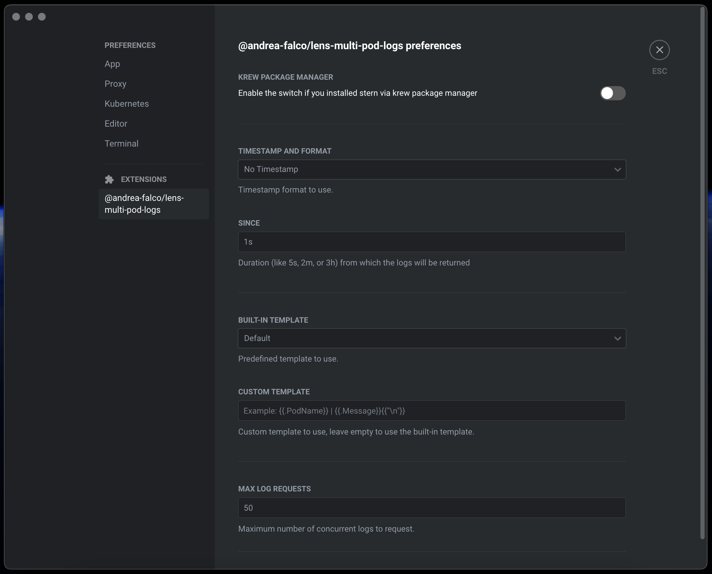

# Multi Pod Logs Lens Extension

  

[](https://ko-fi.com/A0A8J3CMJ)

A [Lens](https://k8slens.dev) (or [OpenLens](https://github.com/lensapp/lens)) extension that enables you to see logs from multiple pods *(and multiple containers within the pod)* on Kubernetes.

## 🚧 Requirements
- Lens (or OpenLens) `>= 6.0.0`
- [stern](https://github.com/stern/stern/releases) `>= 1.23.0`
> ⚠️ This extension uses `stern` under the hood, so it needs to be installed on your computer for the extension to work.
> If you don't know how to install it you can follow [these steps](STERN.md).

## 🧰 Installing
Just make sure Lens is running, and follow these simple steps:

 1. Go to Extensions view (`Menu -> File -> Extensions`)
 2. Enter the name of this extension, `@andrea-falco/lens-multi-pod-logs`
 3. Click on the **Install** button
 4. Make sure the extension is enabled


---

## 🚀 Features
After completing the installation, you will see a new action **Multi Pod Logs** for the menu below:
- Deployments
- StatefulSets
- DaemonSets


The new action will open a new terminal where all the logs coming from all the containers of all the pods of the resource will be shown.

## ⚙️ Preferences
Some extension behaviors and parameters can be adjusted from the Lens preferences page, in the appropriate section dedicated to the extension:



## 🎨 Colored logs
If you're using Windows 10/11 *(and PowerShell as terminal in Lens)* and you don't see colored pod logs, you can enable colors running this command:

```
Set-ItemProperty HKCU:\Console VirtualTerminalLevel -Type DWORD 1
```

Then restart Lens.

---

## Upgrading
To upgrade to a newer release, go to the Extensions view, uninstall the extension, and then re-install it again.

## Uninstalling
Go to the Lens Extensions view and click the **Uninstall** button next to this extension.
